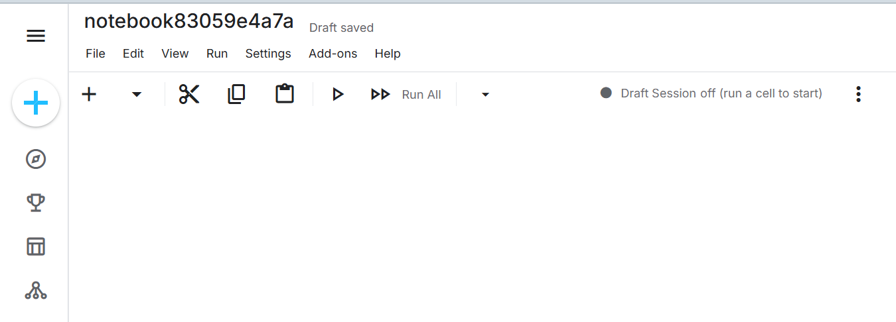
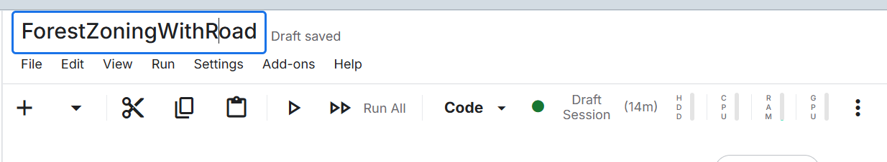
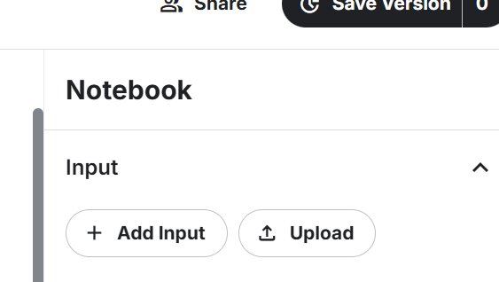
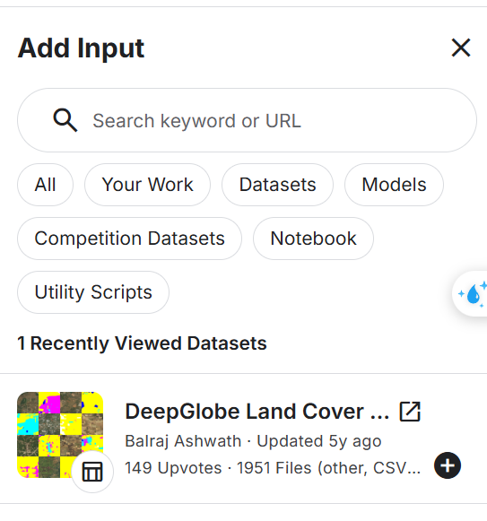
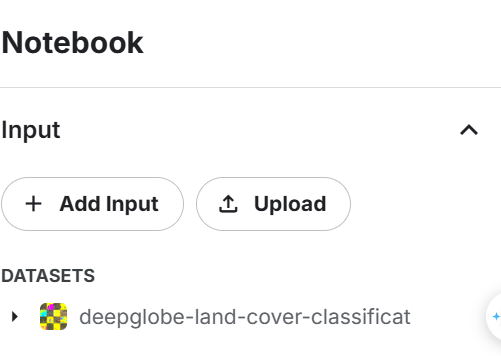
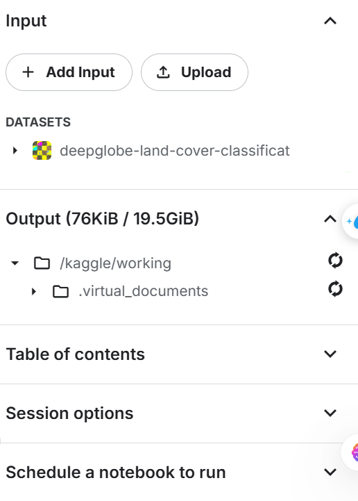
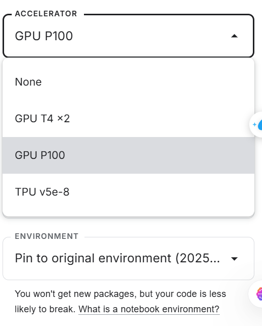

# TRAIN TRÊN KAGGLE

## Cần chuẩn bị - For preparing

- **Môi trường train (training environment)** : Kaggle
- **Datasets :** DeepGlobe Land Cover Classification Dataset
- **Standard time - Computing Resource**: CPU P100

## Tạo notebook trên Kaggle - Create new nootbook on Kaggle

**1. Search**  `kaggle.com`

**2. Tạo notebook - create nootbook** 

- Click `Create` then **select** `Notebook`

- New **Notebook** has been created, now you can **rename** it by typing the text `notebook` next to `Draft saved`

- Its new name

## Chọn datasets để train - Choose datasets for traning

- Click `Add Input`

- If you have searched some dataset relating to `this Project (Forest Zoning With Road)`, it will appear right below the search results like this.

- If not, dont worry. You can try this way. Search your data's name on `Search keyword or URL `. In this **project**, i use **DeepGlobe Land Cover Classification Dataset**.

- Now it appears right below the search result, click **add** to add it for training model.

## Chọn Accelebrator để chạy model - Choose Accelebrator for running model

- Click **Session options**

- Choose appropriate Accelebrator you want, in this project , i choose `GPU P1000`

- If you dont see this item, dont worry. We can easily to use it after verify phone number, find the text that is similar to "Verify your account to enable Internet and GPU"
- After successfully verify, you can see that item.

## Chạy và train model

- Copy all code in file **"train_forest_segmentation_unet_resnet34"** to
# Model_ForestZoning_With_Road
